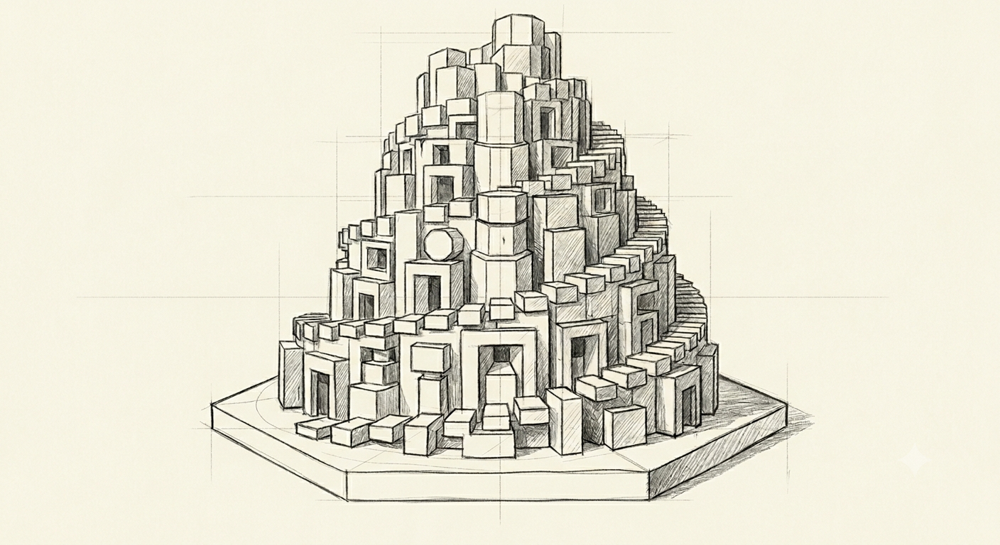
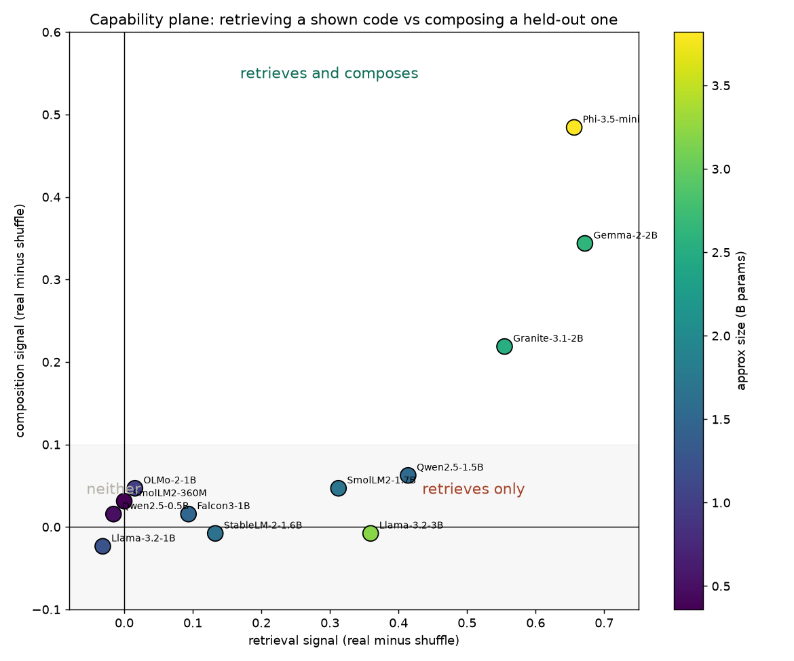
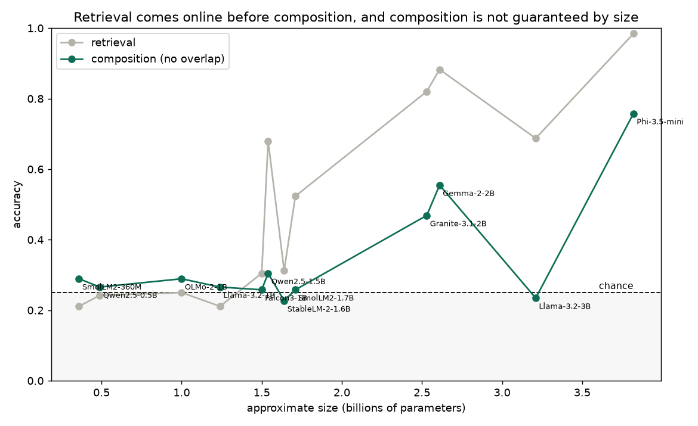
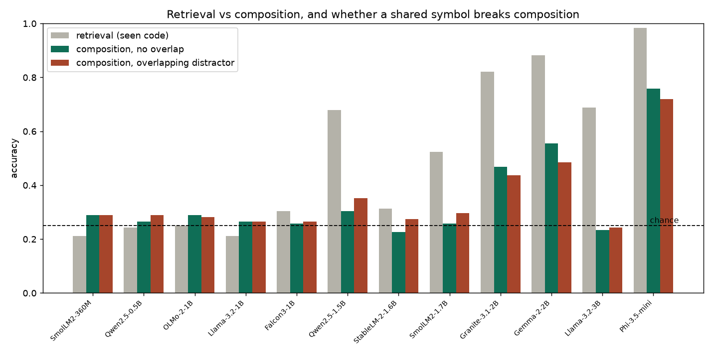
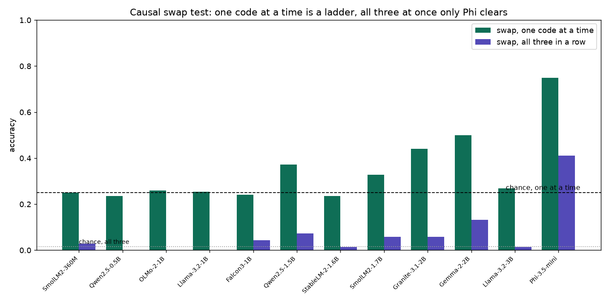
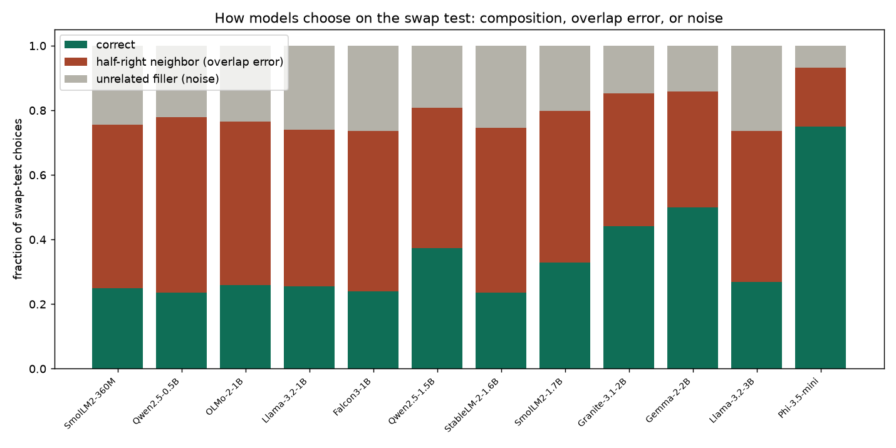

```
██████╗  █████╗ ██████╗ ███████╗██╗
██╔══██╗██╔══██╗██╔══██╗██╔════╝██║
██████╔╝███████║██████╔╝█████╗  ██║
██╔══██╗██╔══██║██╔══██╗██╔══╝  ██║
██████╔╝██║  ██║██████╔╝███████╗███████╗
╚═════╝ ╚═╝  ╚═╝╚═════╝ ╚══════╝╚══════╝
```

<p align="center"></p>

# Before Babel

**TL;DR.** Can a small model read an invented code, where objects are number pairs and each number maps to a nonsense symbol? Two abilities split apart. Looking up a code you were shown comes online around 1.5B. Composing one you were not, by combining the per-position rules, comes later, around 2.5B, and only in some families. Size does not buy composition: Llama-3.2-3B is the second largest model here and cannot compose at all. Only Phi-3.5 composes robustly under a strict swap test, Gemma and Granite are fragile. A shared compositional language is the rare achievement, not the default. Working notes, not peer reviewed.

**ELI5.** We made up a tiny secret code and asked twelve small AIs to read it. Looking up a code they were shown is easy. Working out a code they were never shown is much harder, and only the bigger, better-trained ones manage it, and being big is not enough on its own. So the idea that many AIs would naturally land on one shared language is backwards: almost none of them can even read one.

## The question behind the question

The Babel story assumes that a shared language is where everyone starts and confusion is the thing that happens to them later. I wanted to run the experiment that the story skips: hand a model a small invented language with a clean rule, and see whether it can actually read it. Not memorize a phrasebook, read it, in the sense of working out the rule from examples and applying it to a message it has never seen.

That turns out to be the part that matters. Before you can ask whether twelve models would converge on a shared tongue, you have to ask whether any single one of them can hold a compositional code in its head for the length of a prompt. Most of the ones I tested cannot, and the line between the ones that can and the ones that cannot is sharp and a little surprising.

## Summary

I built a tiny artificial language. Objects are pairs of numbers, and a code maps each number to a nonsense symbol, one symbol per position, so the message `to ne` means a specific pair. A model is shown a handful of object and code pairs in its prompt and then asked, as a four way multiple choice, which object a new message refers to. I ran this on twelve open instruct models from 0.36B to 3.8B, grading every answer by the probability the model places on each option letter so nothing depends on parsing its prose.

Two different abilities fall out, and they switch on at different points. Retrieving the object for a code the model was actually shown comes online around 1.5B. Composing the object for a held out code, one whose exact message never appeared but whose pieces all did, comes online later, around 2.5B, and only in some model families. It also arrives in degrees rather than all at once. Three models clear the basic composition test, Granite-3.1-2B, Gemma-2-2B, and Phi-3.5-mini, but when I push harder only Phi-3.5-mini holds up. Gemma and Granite compose on the easy version and come apart on the strict one, and a couple of smaller models that mostly retrieve show a faint partial version of the ability. Size alone buys none of it: Llama-3.2-3B is larger than two of the three and composes no better than chance.

## What counts as reading the code

The setup is deliberately small so that the only thing being measured is the rule.

An object is a pair `(a, b)` with `a` and `b` each from a small range. The code gives each position its own pool of symbols, so `a` is written with one of `ka mi to ru so` and `b` with one of `va su ne lo da`, under a fixed but randomly chosen mapping per run. Because the pools are separate, there is never any ambiguity about which symbol belongs to which position. Decoding `to ne` is two independent lookups followed by combining the answers.

The model sees the mapping only through worked examples in the prompt, ten object and code pairs, and the examples always cover every value in every position at least once. That last point is not a detail. It guarantees that every held out message is decodable from what the model was shown, so a wrong answer cannot be excused as missing information. An earlier version of this experiment did not guarantee coverage, sometimes asked a model to decode a symbol it had never been shown, and as a result scored the capable models at chance and hid the very effect I was looking for. Fixing the coverage is what made the result visible.

Three conditions, each with a control:

- Retrieval. The query is one of the objects shown in the examples, and all four answer choices are also objects from the examples. Surface lookup is enough. This asks only whether the model can use an in context table at all.
- Composition without a trap. The query is a held out object, every answer choice is a held out object, and none of the wrong choices shares a symbol with the message. Familiarity cannot help, because nothing on offer was seen, and surface overlap cannot mislead, because no wrong answer shares a symbol.
- Composition with a trap. The same, except one wrong choice now shares a single symbol with the message, a half right decoy. A model that genuinely combines both positions ignores it. A model that leans on a shared symbol gets pulled onto it.

The control in every case is a shuffle. Scramble the codes in the examples so there is no consistent rule, and a model that was actually using the rule falls to chance. Throughout, chance is 0.25 and every cell is 128 trials, so a real effect clears its control by several standard errors.

## Results

The whole result is in one picture. Each model is a point, placed by how far above its shuffle control it scores on retrieval, left to right, and on composition, bottom to top.



There are three regions and the models sort cleanly into them. A cluster at the origin does neither: SmolLM2-360M, Qwen2.5-0.5B, OLMo-2-1B, Llama-3.2-1B, Falcon3-1B, StableLM-2-1.6B. A group pushed to the right but flat along the bottom retrieves but does not compose: SmolLM2-1.7B, Qwen2.5-1.5B, and, the interesting one, Llama-3.2-3B. A group up and to the right does both: Granite-3.1-2B, Gemma-2-2B, Phi-3.5-mini.

Put the same numbers against model size and the two abilities separate in time.



Retrieval climbs out of chance first, around 1.5B, and by 2B it is reliable. Composition stays flat at chance through the whole lower half of the size range and only lifts off above about 2.5B. The gap between the two curves is a real capability gap, and a model can live inside it, decoding a code it was handed while unable to extend the rule one step past the examples.

The cleanest single fact is the dip in the composition curve at 3.2B. Llama-3.2-3B is the second largest model here. It retrieves as well as the composers, 0.69 above a 0.33 control. Its composition score is 0.23 against a 0.24 control, which is to say nothing at all. So composition is not a smooth function of parameter count. Something in how Gemma, Granite, and Phi were trained gives them in context composition that a larger Llama does not have.



The trap condition closes off the obvious objection at this level of difficulty. A model could score above chance on the basic test by noticing that the right answer shares symbols with the message, without ever combining the two positions. If that were the whole mechanism, adding one wrong answer that also shares a symbol would wreck it. With a single decoy it does not. For all three composers the score barely moves, Granite 0.47 to 0.44, Gemma 0.55 to 0.48, Phi 0.76 to 0.72. One half right decoy is not enough to fool them. Whether they survive several decoys at once is a harder question, and it is where the three start to separate, which is the next section.

## Making sure it is composition and not a lucky shortcut

Above chance on a four way choice is suggestive, not conclusive, so I ran two stronger checks aimed squarely at the word composition, and they change the picture in a way worth being honest about.

The first is a causal test. Take a held out object, its position one twin, the object with the same second value but a different first value, and its position two twin. All three share a symbol with each other pairwise, so surface overlap cannot tell them apart. Show all three as choices and ask the model to decode each of their three codes in turn. Getting all three right requires reading the differing symbol in each case. A model that combines positions can do it. A model matching on a shared symbol cannot, because the shared symbol is exactly what is held constant.

The second is a hard condition where every wrong answer is half right, each sharing one position with the target, so the only way to pick the target is to decode both symbols correctly.



These pull the three composers apart. Only Phi-3.5-mini passes the strict test outright, all three swaps correct 41 percent of the time against a one in sixty baseline, and 87 percent on the hard condition. Gemma-2-2B and Granite-3.1-2B, which looked like clean composers on the basic test, mostly fail the strict one, all three swaps correct only 13 and 6 percent of the time, even while they clear the hard condition at 53 and 46 percent. So their composition is real but fragile. They handle one half right decoy and fall apart when forced to nail the exact differing symbol in every direction. Two models that mostly retrieve, Qwen2.5-1.5B and SmolLM2-1.7B, show a faint version of the same thing, a little above their controls on the single swap and the hard condition but nothing on the strict test.

The last picture is the most telling. When a model is wrong on the swap test, did it pick a half right neighbor, which shares one symbol with the target, or the unrelated filler, which shares none.



This turns the binary into a ladder. The smallest models, and Llama-3.2-3B in particular, pick the unrelated filler about a quarter of the time, which is exactly what blind guessing among four choices gives, so they are decoding nothing. The retrieving models suppress the filler well below a quarter and pile their errors onto the half right neighbors, which means they reliably decode one position and miss the other. The composers push further, trading neighbor errors for correct answers, and Phi reaches the top where the filler is almost never chosen and most answers are right. Composition here is not a switch that flips. It is a sequence, guess, then decode one position, then decode both, and the twelve models are spread the whole way along it.

## So is a Tower of Babel possible

Read straight, the myth has it backwards for these models. It assumes a shared language is the natural starting condition and that confusion is a later affliction. Here the shared, systematic, compositional code is the rare and expensive thing, read by three of twelve models on the easy test and by only one of twelve when pushed, and not reliably bought with size. Mutual incomprehension is not a punishment that arrives, it is the default that most of the models never leave.

So a Tower of Babel among models this size would not fall because the builders were scattered into confusion. It would never rise, because most of the builders cannot read the plan. The capacity that the story treats as the easy precondition, a language with a rule that more than one party can apply, is the actual achievement, and it switches on late and unevenly.

This is the honest scope of the claim. I tested the prerequisite, whether one model can read a compositional code, not the full scenario of models inventing a code and handing it to each other. The full scenario is the natural next step, and the prerequisite result is not encouraging for it: a shared language needs at least two parties who can both compose, and in this set only one model, Phi-3.5-mini, composes robustly enough to count on, with Gemma and Granite a fragile maybe. The place to look is among the larger composing models, where the question stops being whether they can read a rule and becomes whether two of them, left to invent their own, would land on rules the other could pick up.

## Limitations

The models are small, 0.36B to 3.8B, and nothing here says where the thresholds sit for larger ones. The code is a clean two position mapping with separated symbol pools, which is about the friendliest compositional structure there is, so these numbers are an upper bound on a harder rule. Approximate parameter counts are used to order the models and should be read as ranks, not measurements. The symbols are fixed nonsense tokens, and a check with numbers or a second symbol set would rule out any quirk of these particular tokens. The capable models are few, so the claim that composition is family dependent rather than size dependent rests on one sharp counterexample, Llama-3.2-3B, and would be firmer with more large models in the set. Robust composition, the kind that survives the strict swap test, shows up in exactly one model here, Phi-3.5-mini, so that end of the claim leans on a single example too.

## Repository structure

| Path | What it is |
|---|---|
| `clean.py` | the main experiment: retrieval, composition, and the overlap trap, across all twelve models |
| `clean_analyze.py` | the per condition figures and the summary table |
| `validate.py` | the causal swap test, the hard condition, and the failure mode tally |
| `graphs.py` | the capability plane, the size thresholds, and the validation figures |
| `figures/` | the figures above |
| `results/` | saved scores |

## Reproduce

    pip install torch transformers
    python clean.py            # core experiment -> results/clean.json
    python validate.py         # the stronger checks -> results/validate.json
    python clean_analyze.py    # per condition figures and table
    python graphs.py           # capability plane, thresholds, validation figures
